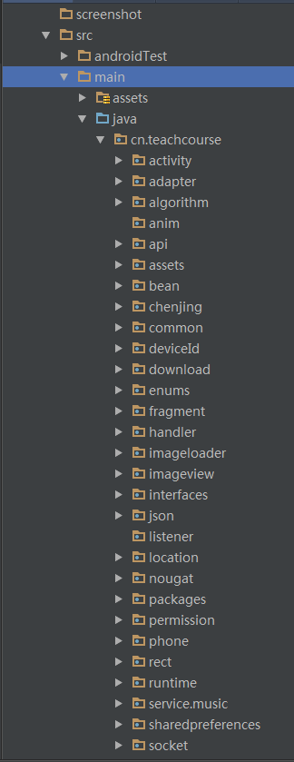
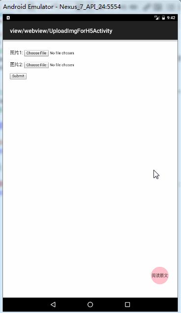
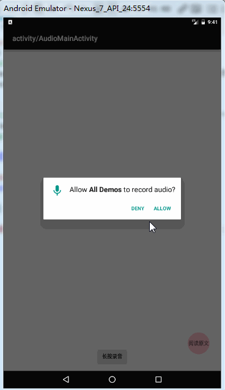

## AllDemos说明
使用Android Studio开发工具，上传的代码包含多个Demo源码，`build.gradle`文件配置编译版本**API 24**，配置目标版本**API 24**，如果Demo需要在Android 6.0以上系统测试，需要添加动态运行权限；如果在Android 7.0系统测试，需要注意行为的变更。

## 一、目录：
根目录：`cn\teachcourse`，在该目录下根据Demo的实现效果命名下一级目录，比如：WebView加载H5页面上传表单数据，对应目录`view\webview\UploadImgForH5Activity.java`

### 1.1 onShowFileChooser或openFileChooser，效果图：

源码存放路径：`view\webview\UploadImgForH5Activity.java`

### 1.2 你或许理解错了Android系统权限管理的这两个概念，效果图：

源码存放路径：`activity\AudioMainActivity.java`

### 1.3 Android开发之深入理解Android 7.0系统权限更改相关文档

- FileProvider源码路径：nougat/WriteToReadActivity.java
- DownloadManager源码路径：download/DownloadActivity.java

