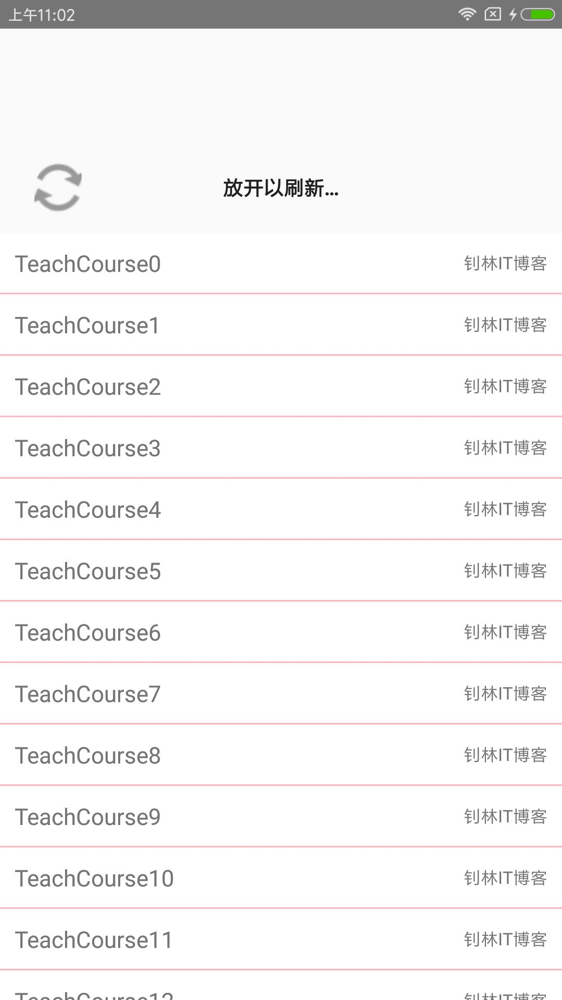
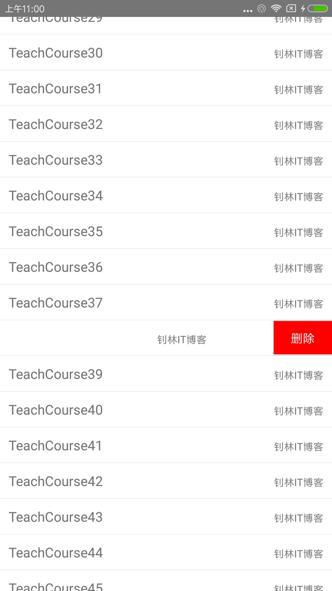
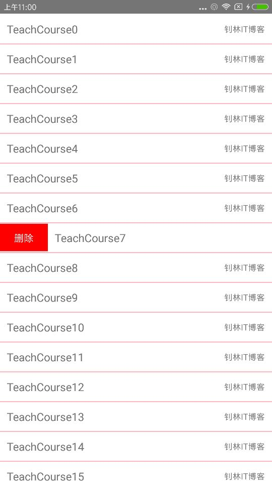

## 概要： ##
当前module封装了滑动删除控件，控件支持左滑出现删除按钮或者右滑出现删除按钮，同时支持下拉刷新和上拉加载更多。

原理自定义ListView控件`SlidingRemovedListView`作为加强版的ListView，自定义item控件`SlidingRemovedItem`支持手势滑动，自定义下拉刷新（上拉加载更多）控件`PullToRefreshSlidingRemovedListView`封装加强版的ListView，实现列表滑动出现删除按钮的效果。

