## 2.3 封装`upversion-library`库，快速接入版本更新功能 ##
`upversion-library`包含自定义通知栏样式，自定义Dialog样式，在`MainActivity`快速接入版本更新功能，[详情文档参考](../upversion/README.md)，效果图：

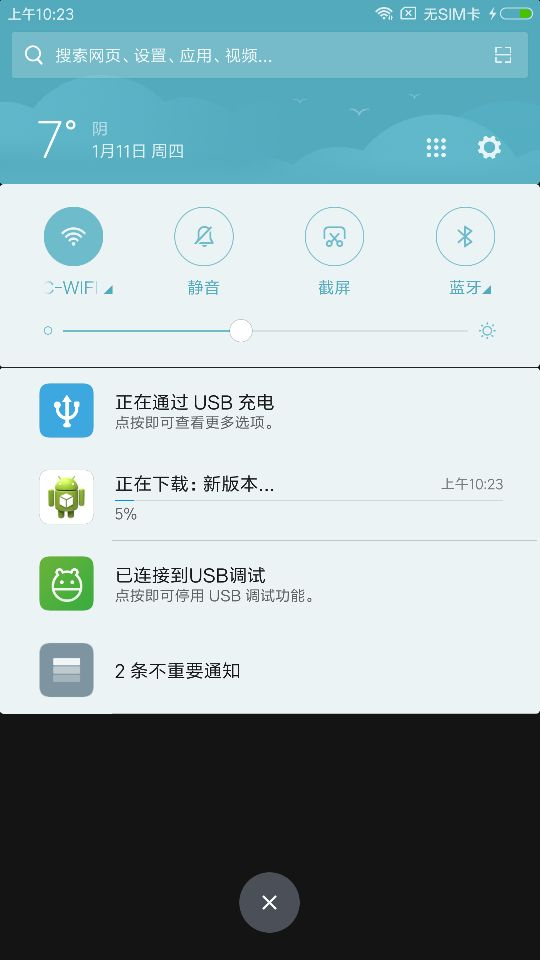
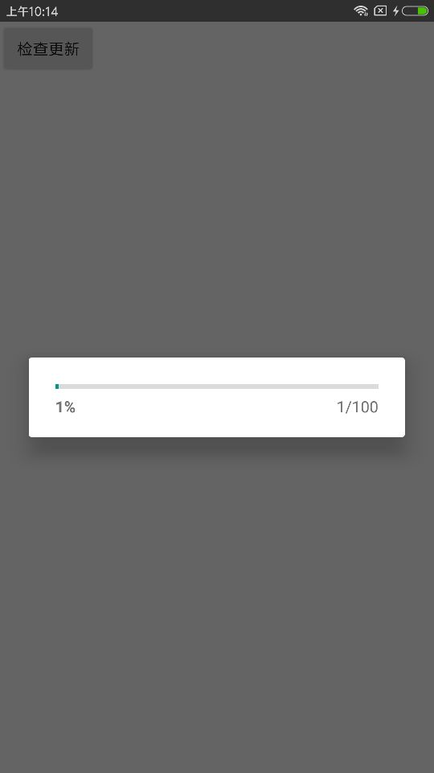
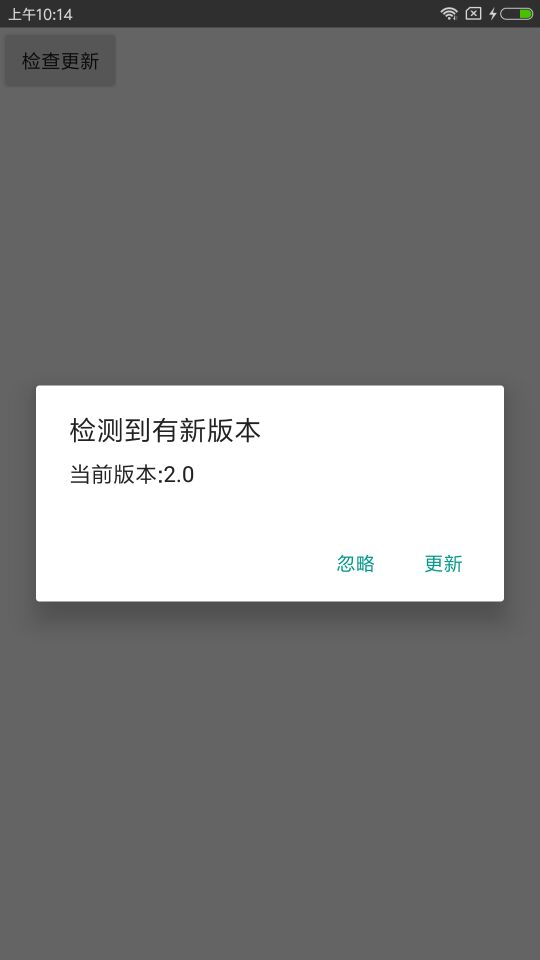

## 2.2 场景动画：Activity之间过渡效果 ##
Activity A启动Activity B，将A中某个View设置为共享元素，并将元素的位置信息保存到Bundle对象中，传递给B，以共享元素为中心点开始动画，实现Activity之间过渡效果，demo存放路径`app\ActivityTransition`


*API 21以上版本支持场景动画*

## 2.1 添加质量压缩、尺寸压缩图片工具类CompressImg ##
工具类`CompressImg`支持图片质量压缩、尺寸压缩，质量压缩需要注意指定图片压缩后存储的位置，质量压缩没有把图片写入文件，然后重新读取，压缩后的图片不但没有变小，反而大概等于：*原图大小+压缩次数x压缩后大小*，也就是变大了，存放在`utils\CompressImg`。
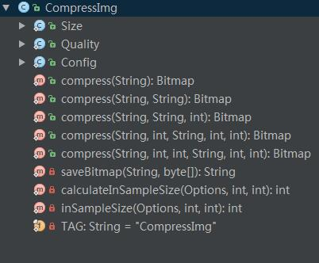

## 2.0 解决ViewPager删除数据，更新没反应的问题 ##
将PagerAdapter进一步封装PPagerAdapter，添加相册预览图片的demo，存放`view\PreviewPicture`，点击左上角icon，删除成功并刷新完成。

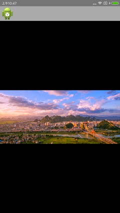

## 1.9 Android开发之枚举（Enum）在实际项目中的应用 ##
目录结构如下图：

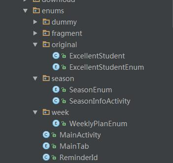

源码路径：`app\src\main\java\cn\teachcourse\enums`

## 1.8 Android开发之混淆高级教程（一） ##
目录结构如下图：

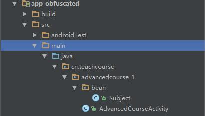

## 1.7 Android Studio集成greenDAO 3.0基础教程 ##
1. greenDAO框架demo存放路径：`app-greendao`
2. 自定义Gradle Plugin存放路径：`app-groovy`
3. 应用自定义Gradle Plugin例子存放路径：`sample`

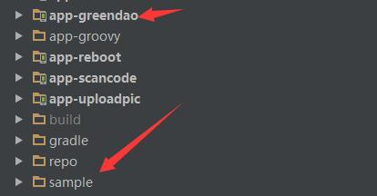

## 1.7 Android开发之混淆基础教程 ##
新建项目`app-obfuscated`存放混淆相关demo，如下图：

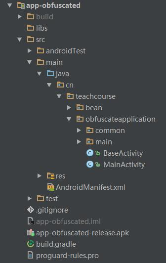


## 1.6 深入理解工厂模式 ##
源码存放路径：`designpattern/factory`

目录结构：

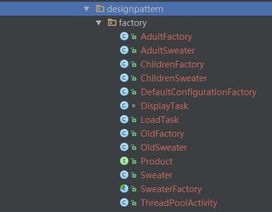


## 1.5 使用*策略模式*重构钟表视图（WatchView） ##
重构钟表视图Demo源码，存放在独立的app-clock，包含构建设计模式、策略设计模式。

目录结构：

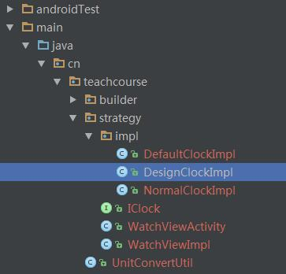


## 1.4 自定义漂亮的钟表视图（WatchView） ##
简单使用：
```
    WatchView.Builder builder=new WatchView.Builder(this);
    WatchView watchView=builder.create();
```
| 默认效果 | 修改样式 |
| ----- | ----- |
| 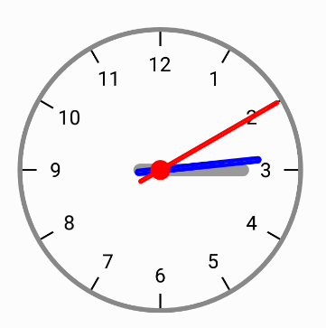 | 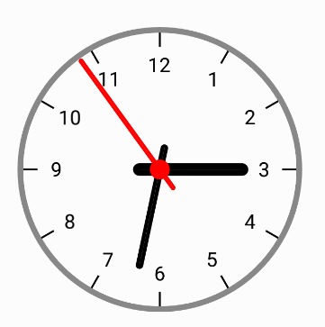 |
| 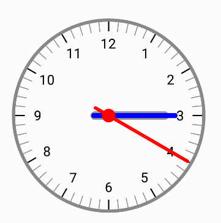 |  |

样式修改：
```
    builder.setRadius(300f);
    builder.setMinuteColor(Color.BLUE);
    builder.setSecondColor(Color.RED);
    builder.setHourColor(0xff999999);
    builder.setPadding(10f);
    builder.setShortScaleColor(Color.WHITE);
```

- `WatchView`源码路径：`view/WatchView.java`


## 1.3 Android开发之深入理解Android 7.0系统权限更改相关文档


- FileProvider源码路径：`nougat/WriteToReadActivity.java`
- DownloadManager源码路径：`download/DownloadActivity.java`


## 1.2 你或许理解错了Android系统权限管理的这两个概念，效果图：


- 源码存放路径：`activity\AudioMainActivity.java`


## 1.1 onShowFileChooser或openFileChooser，效果图：


- 源码存放路径：`view\webview\UploadImgForH5Activity.java`

## 目录：
根目录：`cn\teachcourse`，在该目录下根据Demo的实现效果命名下一级目录，比如：WebView加载H5页面上传表单数据，对应目录`view\webview\UploadImgForH5Activity.java`


## AllDemos说明
使用Android Studio开发工具，上传的代码包含多个Demo源码，`build.gradle`文件配置编译版本**API 24**，配置目标版本**API 24**，如果Demo需要在Android 6.0以上系统测试，需要添加动态运行权限；如果在Android 7.0系统测试，需要注意行为的变更。


